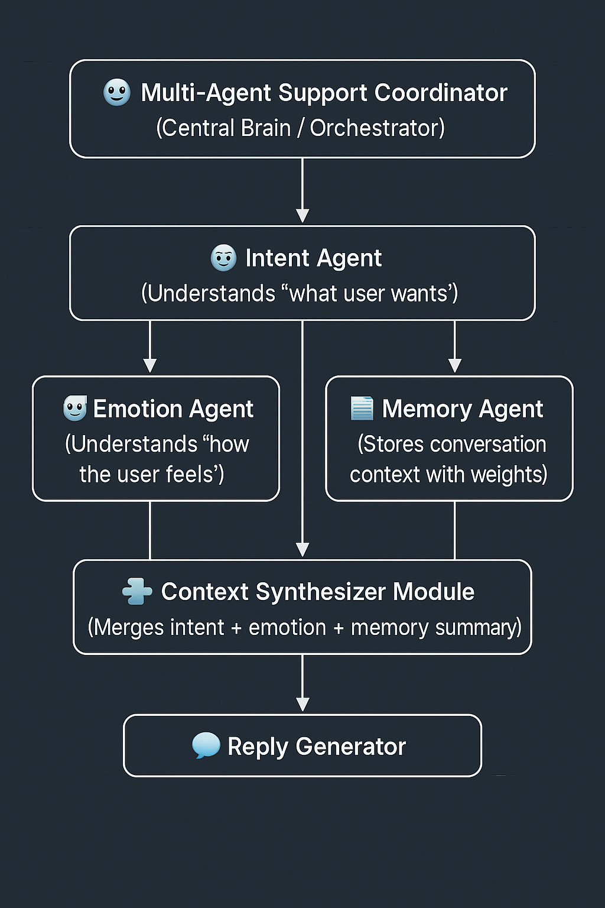

# 🤖 Multi-Agent Intelligent Customer Support System (Agent Shutton)

A medium-advanced, modular multi-agent system designed to provide intelligent, empathetic, and context-aware customer support.  
Agent Shutton uses a coordinated set of independent agents — Intent, Emotion, Memory, and Reply — to simulate human-like support behavior with rapid, reliable responses.

---

# 📘 Project Overview — Agent Shutton
Agent Shutton is a multi-agent conversational support system built for enterprise-level assistance.  
It analyzes user intent, emotional tone, and conversation memory to generate accurate, helpful, and empathetic replies.

The system is modular, easy to extend, and suitable for hackathons, production prototypes, and enterprise AI workflows.

---

# 🧩 Problem Statement
Customer support suffers from several core issues:

- Slow and inconsistent response times  
- Lack of emotional understanding  
- No contextual memory in standard chatbots  
- Heavy cost of human support teams  
- Ineffective automation in traditional systems  

Users want **fast, helpful, human-like assistance**, and traditional tools cannot deliver this reliably.

---

# 🚀 Solution Statement
Agent Shutton solves these problems using a **multi-agent AI architecture**, where each agent specializes in a single skill.

### ✔ Intent Agent — *Understands what the user wants*  
### ✔ Emotion Agent — *Understands how the user feels*  
### ✔ Memory Agent — *Stores contextual conversation history*  
### ✔ Reply Agent — *Generates personalized, helpful responses*  
### ✔ Coordinator Agent — *Orchestrates everything together*

This architecture ensures:

- Fast response time  
- Human-like empathy  
- High accuracy  
- Strong context awareness  
- Full automation  
- Horizontal scalability  

---

# 🏗 Architecture



---

# 🔧 Essential Tools & Utilities

### **Languages & Libraries**
- Python 3  
- Dataclasses  
- Regex  
- JSON utilities  

### **Core Agents**
- `IntentAgent`
- `EmotionAgent`
- `MemoryAgent`
- `ReplyAgent`
- `Coordinator`

### **Optional Enhancements**
- FastAPI (REST API version)  
- ADK Web Mode deployment  

---

# 🌟 Value Statement

Agent Shutton provides:

✔ Faster customer support  
✔ Reduced operational cost  
✔ Consistent & accurate answers  
✔ Emotion-aware assistance  
✔ Scalable automation  
✔ Easy explainability (each agent has a clear role)  
✔ Realistic human-like conversation flow  

Perfect for enterprise support systems, apps, websites, and automated helpdesks.

---

# 🛠 Installation

```bash
git clone https://github.com/your-repo/multi_agent_support.git
cd multi_agent_support
pip install -r requirements.txt

▶ Running the Agent (Normal Mode)
python run_demo.py


